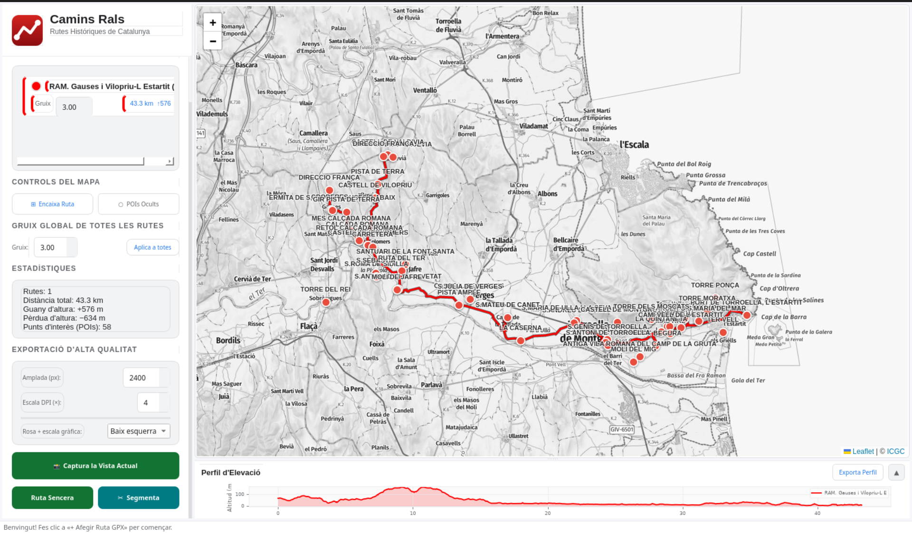

# Camins Rals — Aplicació de Mapes GPX

A desktop application for visualising GPX routes on official Catalan topographic maps and exporting high-resolution images for print.

Built as a tool for the book *Camins Rals de Catalunya* — a guide to the ancient royal roads of Catalonia.

---

## What it does

- Loads one or more GPX files and draws them on the **ICGC topographic map** (Institut Cartogràfic i Geològic de Catalunya)
- Each route gets its own colour and line thickness, both adjustable
- Shows **waypoints / points of interest** from the GPX files
- Displays an **elevation profile** graph for all loaded routes
- Shows **route statistics** — total distance, elevation gain, elevation loss
- Exports **high-resolution PNG images** (4× pixel density) ready for book printing, including:
  - Scale bar and north arrow
  - ICGC map attribution
  - Configurable corner for the cartographic indicators

---

## Export modes

| Mode | Description |
|------|-------------|
| **Captura actual** | Exports exactly what you see on screen |
| **Tota la ruta** | Auto-fits all loaded routes into a single image |
| **Per trams** | Splits the route into N equal-length segments, one image per segment |

---

## Screenshots



---

## Installation

### Windows — pre-built

1. Go to [Actions → latest successful build](https://github.com/dpiera/camins-rals/actions)
2. Click on the most recent **Build Windows App** run
3. Scroll to the bottom and download **CaminsRals-Windows.zip**
4. Unzip anywhere (e.g. `C:\Camins Rals\`)
5. Double-click **CaminsRals.exe**

No installation required. No internet connection needed after download.

---

### From source (Linux / macOS / Windows)

**Requirements:** Python 3.11+

```bash
git clone https://github.com/dpiera/camins-rals.git
cd camins-rals

pip install PyQt5 PyQtWebEngine gpxpy matplotlib playwright
playwright install chromium

python app_7.py
```

---

## How to use

1. **Add a route** — click "Afegeix fitxer GPX" and select a `.gpx` file
2. **Adjust appearance** — change the route colour (click the colour swatch) and line thickness
3. **Explore the map** — pan and zoom freely; the elevation profile updates automatically
4. **Toggle waypoints** — show or hide points of interest with the "Punts d'interès" button
5. **Choose export corner** — pick where the scale bar and north arrow appear (bottom-left, bottom-right, etc.)
6. **Export**:
   - *Captura actual* → saves what you see now
   - *Tota la ruta* → auto-zooms to fit everything
   - *Per trams* → opens a dialog to choose how many segments and the output folder

---

## Map data

Topographic tiles are served by the **Institut Cartogràfic i Geològic de Catalunya (ICGC)** — the official mapping authority of Catalonia.

Map: © [ICGC](https://www.icgc.cat/) — [Termes d'ús](https://www.icgc.cat/ca/Inici/Serveis/Serveis-en-linia/Serveis-WMS-i-WMTS)

---

## Technical stack

| Component | Role |
|-----------|------|
| PyQt5 + QWebEngineView | Desktop window + embedded browser |
| Leaflet.js 1.9.4 | Interactive map rendering |
| ICGC WMTS | Topographic tile source |
| gpxpy | GPX file parsing |
| Matplotlib | Elevation profile chart |
| Playwright (Chromium) | Headless rendering for high-DPI export |
| PyInstaller | Windows packaging |

---

## Building for Windows

The build runs automatically on GitHub Actions (Windows Server 2022).

To trigger a build manually:
1. Go to **Actions → Build Windows App → Run workflow**

To create a versioned release:
```bash
git tag v7.1
git push --tags
```
This triggers the workflow and creates a GitHub Release with the zip attached.

---

## Project structure

```
app_7.py                  Main application
build/
  app_7.spec              PyInstaller build spec
  requirements_windows.txt Python dependencies for the Windows build
  build_windows.bat       Optional: build locally on a Windows machine
.github/workflows/
  build-windows.yml       GitHub Actions CI/CD workflow
GPX_files/                Sample GPX routes (not tracked in git)
```

---

## About

*Camins Rals* (Royal Roads) were the main communication routes of pre-modern Catalonia — paths used by messengers, merchants, and pilgrims for centuries. This application was built to help document and illustrate those routes in a printed book.
